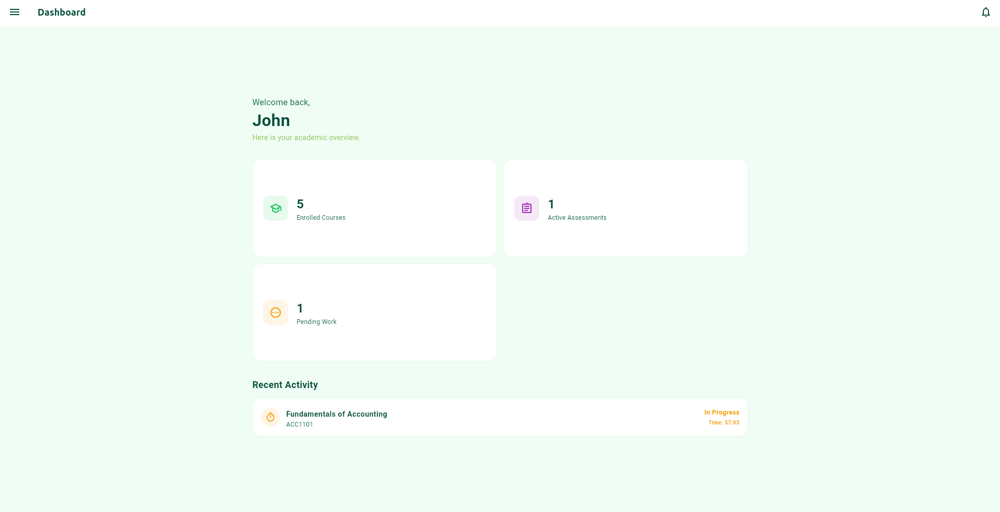
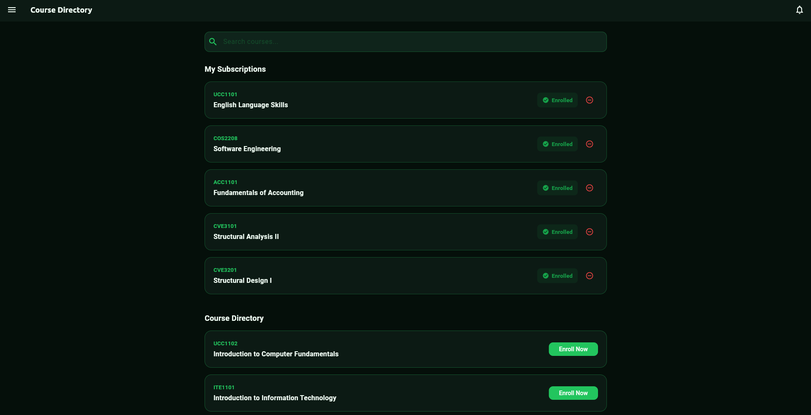
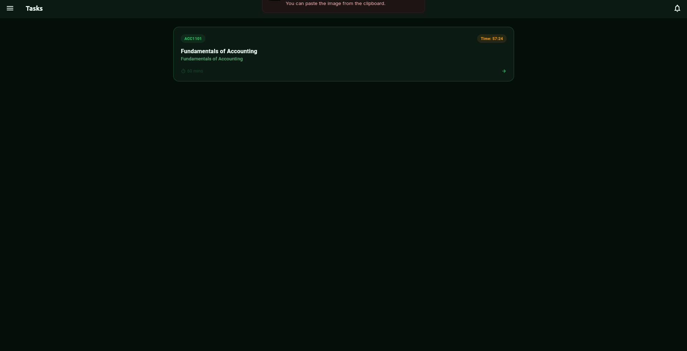
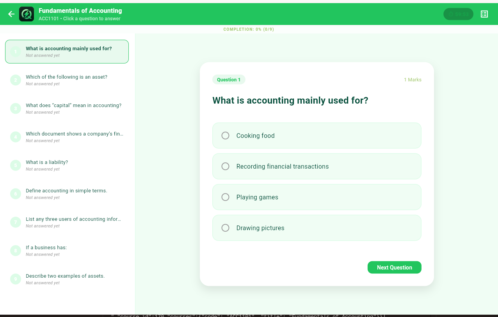
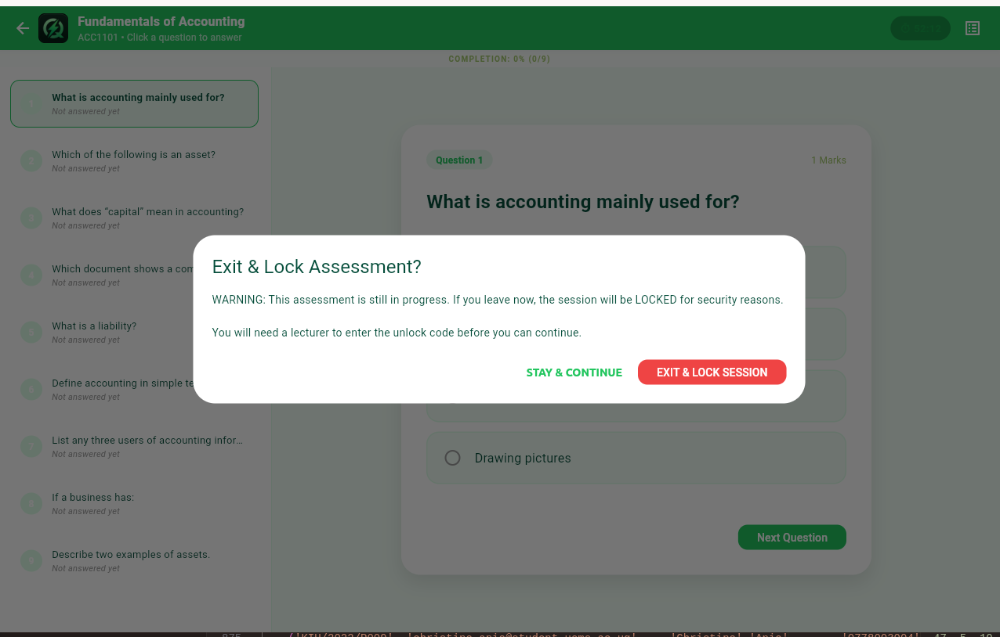
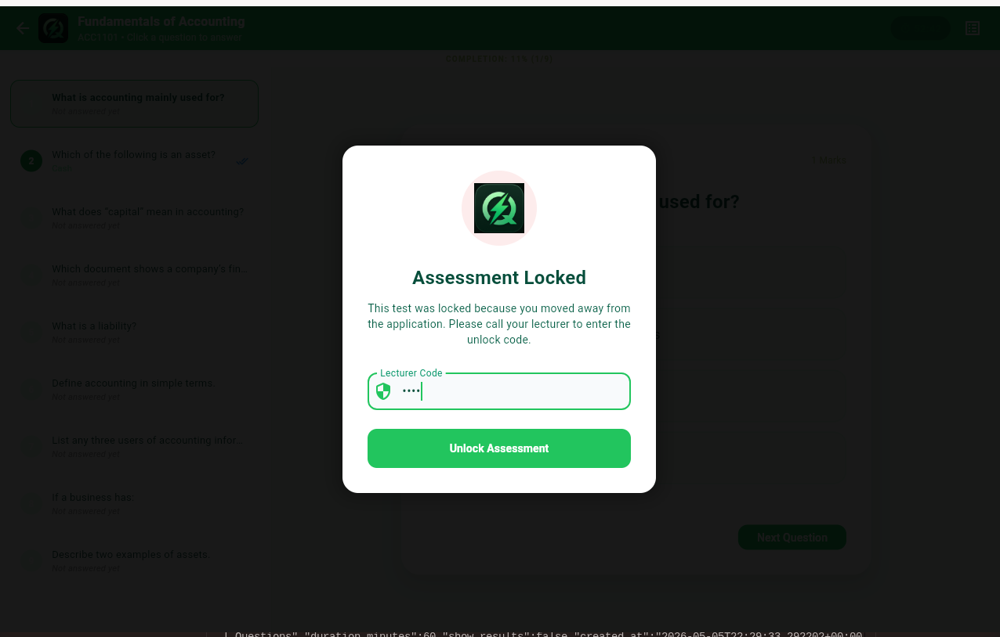

<p align="center">
  
</p>

# Quickfire Exam Portal

A powerful, hardened assessment extension of the **UEMS-PHD-VV** platform — built exclusively for **Kampala International University** students and designed to uphold academic integrity while ensuring a seamless examination experience.

---

## ✅ Functional Features

These are the core capabilities the system performs — what the application *does*.

### 🔐 Authentication & Access Control
- Students log in via the UEMS-PHD-VV authentication system to access their personal exam portal.
- Role-based access distinguishes between **Students**, **Lecturers**, and **Supervisors**, with each role having scoped permissions.
- Supervisor verification is required to unlock any locked or resumed session using a secure 4-digit PIN *(Default: `8888`)*.

### 📋 Assessment Management
- Students can view all assigned assessments from the **Unified Tasks Hub**, categorized as active, in-progress, or completed.
- Assessments can be started, paused (with lockdown), and resumed (with supervisor authorization).
- Each assessment enforces a configurable countdown timer visible throughout the exam.

### ✍️ Exam-Taking Engine
- Students answer questions within a locked, distraction-free environment.
- A **left sidebar** allows quick navigation between questions without losing the current state.
- Answers are **auto-saved** continuously via a debounced background sync queue, preventing any data loss.

### 💾 Offline & Sync Support
- The application caches progress locally, allowing students to continue working during network outages.
- Upon reconnection, the sync engine automatically pushes all pending responses to the Supabase backend.

### 🔍 Submission Preview (Privacy Mode)
- Completed assessments can be reviewed from the Tasks list using a dedicated **Answer Preview** mode.
- This mode hides all grading metrics — marks, percentages, and correct/wrong labels — showing only the submitted content.

### 📄 PDF Export
- Students and administrators can export a submission as a professionally formatted PDF.
- Exported reports carry official **KIU branding** and are suitable for printing and institutional archival.

### 🔒 Lockdown & Security Enforcement
- The application detects and responds to: window focus loss, minimization attempts, fullscreen exits, and back-button presses.
- Any violation immediately triggers a **Security Lockdown** screen, halting the assessment until a supervisor unlocks it.
- Lockdown state persists across app restarts — the session remains locked even if the application is closed and reopened.

---

## 🔧 Non-Functional Features

These define *how well* the system performs — quality attributes, constraints, and system behaviour.

### ⚡ Performance
- Answers are synced via a **debounced queue** to minimize redundant network requests without sacrificing data safety.
- The UI maintains smooth rendering under kiosk lockdown conditions, even on low-spec Linux desktops common in university labs.

### 🛡️ Security
- All backend data access is governed by **Supabase Row-Level Security (RLS)** — students can only read and write their own records.
- The 4-digit supervisor PIN is a secondary access control layer that operates independently of the primary auth system.
- The platform implements the **UEMS "Ironclad" Security Standard**, a multi-layer protocol covering kiosk mode, behavioral lockdown, and visual accountability.

### 🔁 Reliability & Fault Tolerance
- Local caching ensures that no exam progress is lost due to connectivity interruptions.
- Lockdown state is persisted to local storage, surviving unexpected app terminations or device restarts.

### 🌍 Cross-Platform Consistency
- Security and lockdown protocols behave consistently across **Linux Desktop, Android, iOS, and Web** targets.
- Platform-specific implementations are abstracted behind a unified `fullscreen.dart` bridge.

### 🎨 Usability & Branding
- The interface follows a **Premium Green Design System** (`theme.dart`) aligned with the official KIU visual identity.
- All dialogs, overlays, and warnings use formal academic language appropriate for an examination context.
- High-contrast **Security Lockdown** overlays are designed to be immediately visible to invigilators across a room.

### 🔧 Maintainability
- Business logic is cleanly separated into `services/`, `utils/`, and `screens/` layers for ease of maintenance and testing.
- The PDF engine and sync queue are modular and independently replaceable without affecting the core exam flow.

---

## 🚀 Extended Features

Planned and advanced capabilities that extend the platform beyond its core assessment function.

### 📊 Analytics Dashboard *(Planned)*
- Lecturers will be able to view per-student time-on-question metrics, submission patterns, and flagged security events from a dedicated analytics panel.
- Aggregate cohort-level data will help identify questions with unusually high skip or error rates.

### 🤖 AI-Assisted Integrity Flagging *(Planned)*
- Machine learning models will analyze behavioral metadata (e.g., answer-change frequency, time gaps between responses) to flag statistically anomalous submissions for human review.
- Flagged assessments will be routed to a supervisor review queue rather than being automatically penalized.

### 📱 Push Notification System *(Planned)*
- Students will receive push notifications for upcoming exam deadlines, newly assigned assessments, and grade releases.
- Lecturers will be alerted when a student triggers a security lockdown during a live exam session.

### 🌐 Multi-Institution Support *(Planned)*
- The platform architecture will be extended to support multi-tenant deployments, allowing other universities to onboard under their own branding and UEMS configuration.
- Each institution will have isolated data namespaces enforced at the database level via Supabase RLS policies.

### 🗣️ Accessibility Enhancements *(Planned)*
- Screen reader support (TalkBack / VoiceOver) will be introduced to make the exam environment accessible to students with visual impairments.
- Font scaling and high-contrast theme variants will be configurable per-student without compromising the security lockdown posture.

### 🖨️ Batch PDF Export *(Planned)*
- Administrators will be able to generate bulk PDF reports for entire cohorts in a single operation, with a ZIP archive download for offline storage.

### 🔑 Biometric Unlock *(Planned)*
- As an alternative to the 4-digit PIN, fingerprint or face recognition will be supported on compatible devices for faster supervisor verification during busy exam sessions.

---

## 🛡️ Security & Integrity Protocol

Quickfire implements the **UEMS "Ironclad" Security Standard**:

1. **Persistent Kiosk Mode** — Fullscreen and "Always-On-Top" enforcement prevent unauthorized window switching.
2. **Behavioral Lockdown**
   - **Focus Loss** — The session locks immediately if the application loses window focus.
   - **Minimization** — Any attempt to minimize the app triggers a security violation.
   - **Back-Button Interception** — Intelligent `PopScope` integration intercepts accidental exits with a formal confirmation dialog.
3. **Supervisor Verification** — Re-entry into any locked or resumed session requires a lecturer to enter a secure 4-digit PIN *(Default: `8888`)*.
4. **Visual Accountability** — High-visibility "Security Lockdown" overlays make unauthorized activity immediately apparent to invigilators.

---

## 🚦 Tech Stack

| Layer | Technology |
|---|---|
| **Framework** | Flutter 3.x (Hardened Build) |
| **OS Support** | Linux Desktop, Android, iOS, Web |
| **Backend** | Supabase (PostgreSQL with RLS + REST Logic) |
| **Desktop Security** | Window Manager 0.5.x + Custom Focus Listeners |
| **Reporting** | PDF Library with Custom Branding Engine |
| **Data Flow** | Debounced Background Sync Queue |

---

## 📁 Project Structure

```
lib/
├── main.dart                    # Entry point & window initialization
├── theme.dart                   # Premium Green design system
├── services/
│   ├── supabase_service.dart    # Cloud API & transactional logic
│   └── offline_service.dart     # Background task sync & caching
├── utils/
│   ├── fullscreen.dart          # Platform-specific lockdown bridge
│   └── report_exporter.dart     # PDF generation engine
└── screens/
    ├── assessment_screen.dart   # Secure exam engine (lockdown + confirmation)
    ├── home_screen.dart         # Unified Task Hub & dashboard
    └── report_screen.dart       # Academic submission preview
```

---

## 📖 How to Use the Application

### 1. Dashboard & Course Directory

Upon logging in, you land on your primary dashboard.

- The **Dashboard** displays key metrics such as pending tasks and recent activity.
- The **Courses** tab lets you browse all enrolled classes.




---

### 2. Unified Tasks Hub

Navigate to the **Tasks** tab to manage your assessments.

- Available tasks can be launched directly from this view.
- Completed tasks display a success badge and can be reviewed by tapping them.



---

### 3. The Exam Environment

Starting an assessment activates **Persistent Kiosk Mode** for a distraction-free experience.

- Use the left sidebar to jump between questions quickly.
- Answers are **auto-saved** continuously via the background sync engine.
- A live countdown timer is always visible.



---

### 4. Back-Button Interception

The exam environment prevents accidental and unauthorized exits.

- Pressing the system back button or attempting to close the screen triggers a formal confirmation dialog outlining the academic integrity consequences of exiting.



---

### 5. Security Lockdown

If the environment is bypassed (e.g., switching windows, minimizing, or exiting fullscreen):

- A high-visibility **Security Lockdown** overlay immediately halts the assessment.
- Only an authorized lecturer can resume the session by entering their 4-digit verification PIN.



---

## 📝 Operating Notes

- **Unified Navigation** — The "Preview" module is integrated into the Tasks list. Completed assignments are marked with a "Completed" badge and reviewable directly from there.
- **Privacy Mode** — `showResults` is set to `false` by default for student previews, hiding all marks, scores, and fractional counts to keep focus on the submitted content.
- **Lockdown Persistence** — Once triggered, a lockdown persists across app restarts until a supervisor provides the unlock code.

---

<p align="center">
  <strong>Spider Tabs Ltd · UEMS-PHD-VV © 2026</strong><br/>
  <em>Kampala International University</em>
</p>